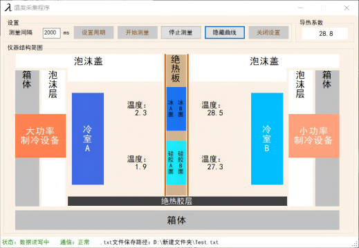
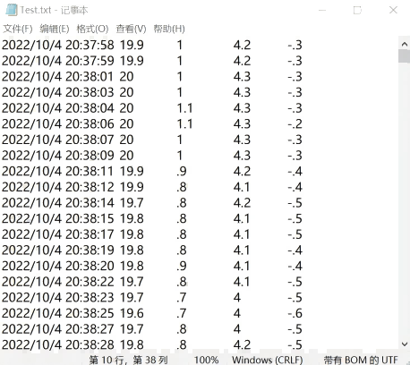

# Temperature_acquisition_and_ice_thermal_conductivity_measurement_based_on_RS485_and_MODBUS-RTU

Based on RS-485 interface and MODBUS-RTU communication protocol, real-time reading and writing data of the four-channel temperature digital reader can be realized at the same time to draw the sample temperature change curve, calculate the thermal conductivity, and draw the thermal conductivity curve. The software can set the serial port information and read and write interval.

**Device appearance:**

**Four-channel temperature digital reader:**

**Temperature acquisition and thermal conductivity calculation:**

**Temperature change and thermal conductivity curve:**

**Data saved:**

